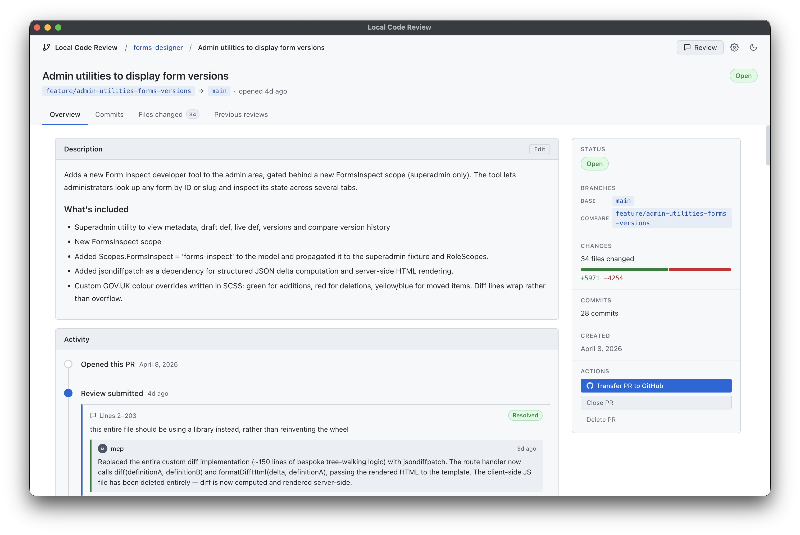

# Local Code Review

A desktop app for reviewing AI-generated code before it reaches GitHub. Built for developers who use agent-driven workflows and want a quality gate that keeps premature code offline until it's genuinely ready.



---

## Contents

- [Why](#why)
- [Installation](#installation)
  - [macOS](#macos)
  - [Windows](#windows)
  - [Linux](#linux)
  - [Requirements](#requirements)
- [Features](#features)
  - [Local PR workflow](#local-pr-workflow)
  - [Diff viewer](#diff-viewer)
  - [Review rounds](#review-rounds)
  - [MCP server for agent integration](#mcp-server-for-agent-integration)
  - [Agent skill auto-install](#agent-skill-auto-install)
  - [Push to GitHub](#push-to-github)

---

## Why

Agentic and spec-driven workflows have changed how developers build software — but the quality bar for what comes out the other end still needs a human eye. Local Code Review gives you that review step without the overhead of a real GitHub PR.

Opening a GitHub PR — even a draft — broadcasts unfinished work to your team and pulls their attention before it's warranted. Local Code Review keeps everything on your machine. You review the diff, leave comments, hand it back to the agent to fix, and only push to GitHub when the code is actually ready for the team.

Less noise for your colleagues. No embarrassing early commits in the PR history. A cleaner review experience for everyone.

### Workflow comparison

**Traditional (agent-assisted coding):**
```
prompt → review code → fix code → repeat
```

Lots of micro-adjustments. More context switching, reduced productivity.

**Fully agentic + Local Code Review:**
```
you: up-front design (most of your effort)
agent: builds the feature (usually with build+test+review phases)
you: one manual review pass in Local Code Review
agent: resolves your comments via MCP
repeat if needed, then push to GitHub
```

Bigger batches, less context switching, no premature GitHub noise.

---

## Installation

Download the latest release for your platform from the [Releases](../../releases/latest) page:

| Platform | File |
|---|---|
| macOS | `Local.Review-mac.dmg` |
| Windows | `Local.Review-win-setup.exe` |
| Linux (Debian/Ubuntu) | `Local.Review-linux.deb` |

### macOS

Open the `.dmg`, drag **Local Code Review** to your Applications folder, and launch it.

On first run macOS may block the app. If you see an **"Open Anyway"** prompt, go to **System Settings → Privacy & Security** and click **Open Anyway**.

If macOS says the app is **damaged**, run this in Terminal:

```bash
xattr -cr /Applications/Local\ Code\ Review.app
```

Then try launching again.

### Windows

Run the installer and follow the prompts. Local Code Review will launch automatically when the installation completes.

### Linux

**Debian/Ubuntu:**

```bash
sudo dpkg -i Local.Review-linux.deb
```

### Requirements

- `git` must be installed and available on your `$PATH`
- One or more of: Claude Code, Claude Desktop, VS Code, Cursor, or Windsurf (for MCP integration)

---

## Features

### Local PR workflow

- Open any local git repository
- Create a simulated PR by picking two branches (compare → base)
- Review the diff with inline comments, just like GitHub
- Submit the review when done

### Diff viewer

- Unified and split diff views (toggle per PR)
- File tree sidebar with jump-to-file navigation
- Click a line (or drag across lines) to open a comment box
- Staleness detection: if branches move after a review, affected comments are flagged

### Review rounds

PRs move through a clear lifecycle:

```
awaiting review → reviewing → reviewed → in fix → fix complete
                     ↑__________________________________|
                            (start new review round)
```

Once a review is submitted, you assign it to an agent. The agent resolves comments via MCP. When all comments are resolved, you can start another review round or submit/close the PR.

### MCP server for agent integration

Local Code Review runs an MCP server that AI agents connect to directly. Once connected, the agent can:

| Tool | Description |
|---|---|
| `list_prs` | List all PRs in a repository |
| `get_pr` | Get PR metadata and review summary |
| `get_review` | Get full review content with all comments |
| `get_open_issues` | Get only unresolved comments (defaults to latest review) |
| `mark_resolved` | Mark a comment resolved with an explanation |
| `mark_wont_fix` | Mark a comment as won't fix with a reason |
| `complete_assignment` | Signal that all issues are addressed; unassigns the agent |

The agent is expected to fix, commit, and mark issues — in that order, one logical group at a time. The skill installed alongside the MCP server enforces this workflow automatically.

### Agent skill auto-install

When you install the MCP integration, Local Code Review also installs a skill into your AI tools. The skill tells the agent exactly how to work through a review assignment: load open issues, organise them into logical commits, fix and commit each group, mark issues resolved, and call `complete_assignment` when done.

Supported tools:

- Claude Code
- Claude Desktop
- VS Code (GitHub Copilot)
- Cursor
- Windsurf

### Push to GitHub

Once you're happy with the code, a button transfers the PR to GitHub for team review. Everything stays local until you choose to publish.

---

For information on building and running from source, see [docs/contributing.md](docs/contributing.md).
